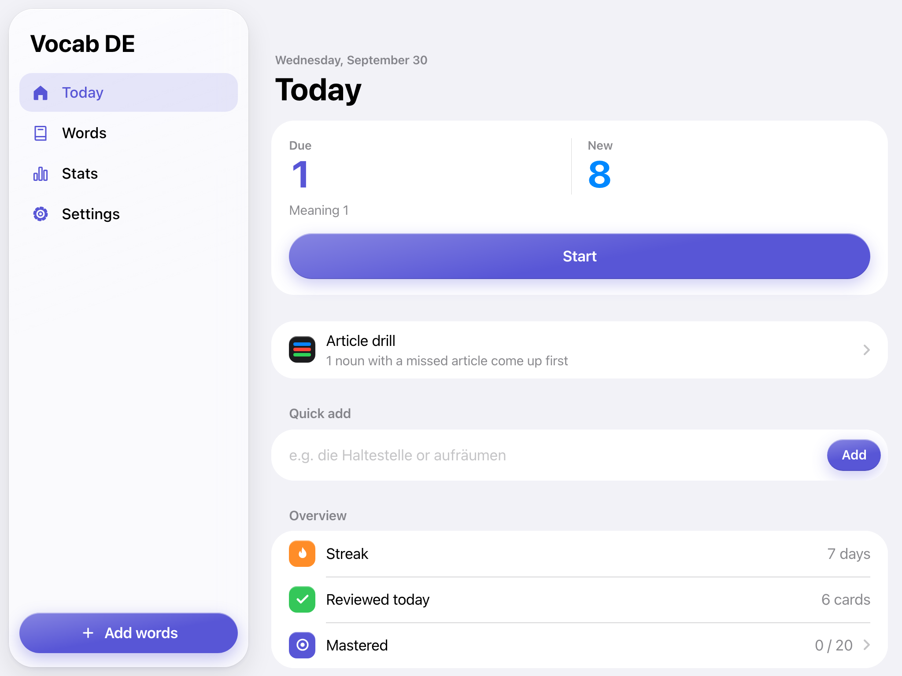
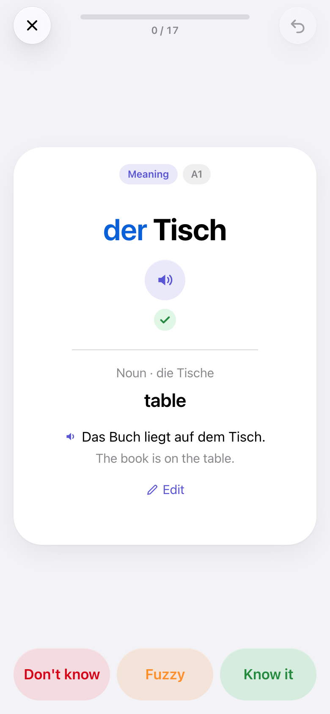
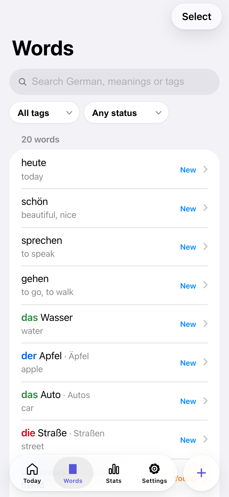
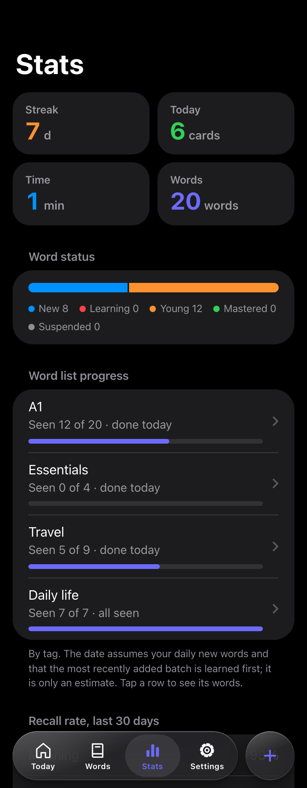

# vocab-de

English | [中文](README.zh-CN.md)

A German vocabulary trainer that runs in the browser. It works on phones, tablets and computers, supports offline study in an ordinary browser, and can optionally be installed as an app. Sync between devices is optional and runs on a server you control. The interface is in English or Chinese, and meanings can be written in any language.



| Article feedback and three grades | Search and organize words | Progress in dark mode |
|:---:|:---:|:---:|
| <a href="docs/screenshots/en/study.png"></a> | <a href="docs/screenshots/en/words.png"></a> | <a href="docs/screenshots/en/stats.png"></a> |

Screenshots use the starter vocabulary and simulated review history, captured in a desktop browser at tablet and phone sizes. Click an image to view it in full.

## Features

- A 20-word A1 starter set to try before importing your own list
- Tags and batch selection for organizing words, pausing/resuming review, and deleting entries
- Sentences and set phrases as well as single words (`Das ist mir egal.`, `auf jeden Fall`); spelling checks ignore punctuation and flag a small typo instead of marking it wrong
- Free practice for a selection or a tag, without touching the review schedule, for a quick pass before a test
- Statistics list the words you keep forgetting, and a word you miss again and again gets a nudge to add an example or break it down

- One card per word: see the German, recall the meaning, and rate it Don't know / Fuzzy / Know it, as in MaiMemo. A noun met for the first time is shown with its article; from then on the article is asked: picking der / die / das also reveals the answer, or you can look at the answer if you don't remember it. A wrong or forgotten article caps that answer at Fuzzy, since knowing a German noun includes its gender. This can be turned off in Settings
- Words you already know from a long list: tap "Already know it" on a new card and its first review is set about two weeks out, so you don't have to go through every word. At the end of a round, the words you missed are listed, so you can add a note or go over them again
- Optional spelling practice (off by default): see the meaning and type the German (nouns with their article), once the meaning is well learned. A correct answer counts as Know it; tap Show answer to recall without typing. Turning it on roughly doubles the daily time
- Scheduling uses [FSRS](https://github.com/open-spaced-repetition/fsrs4anki/wiki/The-Algorithm) (created by Jarrett Ye, who worked on MaiMemo's memory algorithm; FSRS grew out of MaiMemo's DHP model), with a target recall of 85%, 90% or 95%. The first answer of the day decides the next review; a word marked Don't know or Fuzzy comes back a few minutes later that day until you know it, without affecting the long-term schedule
- A predictable workload: one "new words per day" setting, with an estimate of daily minutes two months in based on your own answer speed. After a break, piled-up reviews are spread over a few days and new words pause meanwhile
- The most recently added batch of words is learned first, in its own order, so this week's lesson or a word you just met doesn't wait behind a long list
- When you miss an article, you get the relevant ending rule (-ung → die, -chen → das, ...), the head noun of a compound (Haustür → die Tür), or a note that the word is an exception
- Article drill: learned nouns at random, with the ones you get wrong more often; it doesn't change your schedule
- Short sounds for right and wrong answers and for finishing a session, which can be turned off in Settings; they stay quiet when the phone is on silent
- Word list progress: the Stats screen shows, per tag, how many words you have seen and mastered, and estimates the day the list is finished at your daily pace. Adding and editing offer dictionary shortcuts (Wiktionary, LEO, dict.cc or 德语助手), opened in a new tab; the app itself sends nothing to them
- Adding from elsewhere: select a word on a web page, tap a bookmark, and the Add screen opens with the word and the sentence around it as its example; iOS Shortcuts and your own tools can use the same link. The format and the bookmarklet are on the Import formats page
- Paste or file import (.txt, .csv, .tsv, or drop the file in), including this app's CSV export, Anki plain-text exports and GBK-encoded CSV from Excel. Understands common list formats: `der Tisch, -e - table`, `die Mutter, ¨ - mother`, `gehen, ging, ist gegangen = to go`, Goethe word lists, and two columns copied from a spreadsheet. Plural markers are expanded to full forms
- Offline first: all data lives in the browser (IndexedDB), every release is precached, and changes sync when a connection is available
- Interface modeled on iOS, with a sidebar on wide screens, dark mode, adjustable text size, and support for reduced motion and transparency
- German text-to-speech with the voices your system provides, keyboard shortcuts on computers

## Browser support

The app uses IndexedDB, Service Workers, ES modules and modern CSS. It is intended for recent browsers on iOS, iPadOS, Android, macOS, Windows and Linux. There is no verified minimum-version compatibility matrix yet; installation, speech and storage behavior vary by browser and device.

Read-aloud uses Web Speech. German voice availability and offline speech depend on the browser and system; the app does not bundle audio files.

## Running it

Choose static hosting for local study without a backend, Node.js with SQLite for self-hosted sync, or Cloudflare Workers with D1 for managed sync. All three use the same front end. Learning rules are German-specific; English and Chinese are interface languages, while meanings may be written in any language.

### Self-host with Node.js

Requires Node.js 22.13 or later. Works on a VPS, a NAS or any always-on computer.

```bash
npm install
export SYNC_TOKEN='replace-with-a-long-random-secret'
npm start
```

| Variable | Default | Purpose |
|---|---|---|
| `SYNC_TOKEN` | not set | Sync password; each password is its own library. With none of the three sync variables set the app works, but sync is off |
| `SYNC_TOKENS` | not set | More passwords, separated by commas or spaces, one per person, each with a separate library |
| `SYNC_OPEN` | not set | Set to `1` and anyone who sends a password of 16+ characters gets a library of their own; for public instances |
| `PORT` | `8787` | HTTP port |
| `HOST` | `0.0.0.0` | Bind address; use `127.0.0.1` behind a local reverse proxy |
| `DB_PATH` | `vocab-de.sqlite` | SQLite database path, relative to the working directory |

Use HTTPS for Service Workers and secure-context features such as clipboard access; localhost also works for development. When other devices connect over the network, put the server behind a reverse proxy with a certificate, for example [Caddy](https://caddyserver.com): `caddy reverse-proxy --from vocab.example.com --to localhost:8787`.

### Cloudflare Workers

Uses Workers static assets and D1 without a Node server to maintain. Every request goes through the Worker, which adds the security headers (a strict content security policy and others) to the pages; requests count as Worker requests, far below the free allowance for personal use, but check your account’s current usage limits when deploying.

```bash
npm install
npx wrangler login
npx wrangler d1 create vocab-de
```

Put the `database_id` from the output into `wrangler.jsonc`, then:

```bash
npx wrangler secret put SYNC_TOKEN
npx wrangler deploy
```

For several people, `npx wrangler secret put SYNC_TOKENS` with a list of passwords, or set `SYNC_OPEN` to `"1"` under `vars` in `wrangler.jsonc`.

The database table is created on the first request.

### Static hosting, without sync

The front end is plain files. Run `node scripts/build-sw.mjs` and upload the `public/` folder to any static host (GitHub Pages, Netlify, your own web server). Everything except sync works; data stays on each device and can be moved with Settings → Export / Import backup.

## Browser use and optional installation

Open the deployed URL to study. Local use requires neither an account nor installation. Before going offline, open it online and let the complete release cache download. You can return through a browser bookmark.

If your browser offers installation, these are the usual entry points:

- iPhone / iPad: in Safari, Share → Add to Home Screen
- Mac: in Safari, File → Add to Dock
- Android: in Chrome, menu → Install app
- Windows / macOS / Linux with Chrome or Edge: the install icon in the address bar, or Settings → Install in the app

Do not assume browser tabs and installed apps share local data. Connect sync or import a JSON backup in the context you plan to use. Installation does not guarantee permanent storage.

To enable sync, deploy a backend first. **One password opens one library**: use the same password on all your own devices in Settings → Sync, and have anyone else use theirs, so libraries stay separate. On a private deployment the administrator puts each person's password in `SYNC_TOKEN` / `SYNC_TOKENS`; on an open instance tap "Generate a new password" in Settings. The password is the key to your library, so keep it safe: a lost one cannot be recovered. To connect another device, tap "Copy password for another device" in Settings on one device and "Paste" on the other.

When a device that already has words is switched to another password, those words merge into the new library, and the app asks first; on a device somebody else has used, erase its data in Settings before connecting.

The interface follows your system language. You can change it under Settings → Language.

## Import format

One word per line. Separate the German from its meaning with a tab, ` - `, ` = ` or `: `. Chinese meanings can follow the word directly.

```
der Tisch, -e - table
die Mutter, ¨ - mother
der Lehrer, - teacher
das Kind (-er) - child
gehen, ging, ist gegangen = to go
Zeitung
```

A lone `-` after a comma means "plural same as singular", not a separator. Lines ending in `.`, `?` or `!`, or longer lines, are treated as sentences; two or three words as a phrase. Lines without a meaning or article can be completed in the import preview.

File import (Import from file on the Add screen, or Settings → Word list → Import word list). The app has an Import formats page and a CSV template with examples filled in:

- CSV with a header: columns such as `lemma`/`word`/`german`, `meaning`/`translation`, `article`, `plural`, `example`, `tags` are recognized, so the app's own CSV export imports back as is. The plural column takes the full form or a marker such as `-e` or `¨-er`; `—` means no plural. After choosing a file you see which columns were recognized
- CSV or TSV without a header: German, meaning, then optionally example and its translation
- Anki: export with "Notes in Plain Text"; lines starting with `#` are skipped and HTML in fields is removed
- Any other text file is read line by line as above

## How sync works

Clients first pull changes by a server sequence number, then upload their own; sequence numbers and records are separate for each password. When a word was changed on two devices, the client merges the copies: text such as the meaning comes from the later edit, and each card from the later review, so an offline review on one device can't undo an edit made on another. The merge is uploaded again, so all devices converge. The server itself keeps the record with the newer update time. Device clocks that are far off can affect the result. Review logs sync by their own IDs. The Cloudflare Worker and the Node server serve the same API.

## Data and backup

Words, review history and settings are stored locally. JSON export includes words, review history and settings. Import merges words and review history, and restores the settings when the backup's are newer. With sync off, the home screen reminds you once two weeks pass without a backup. CSV export is a word list without review history, and can be imported again. Clearing site data or browser storage eviction can remove local data. Export a backup before changing domains or browser profiles.

Each sync password is its own library; there are no accounts, e-mail addresses or password recovery. The server stores only a hash of the password and keeps all records apart by it, so whoever holds a password can read and change that library and cannot see anyone else's. The password protects `/api/*`; the app page itself is public. On an open instance each library has a size limit (200,000 records, 64 KB each) but there is no other rate limiting, so put a public deployment behind a reverse proxy or Cloudflare rules that limit requests. Use HTTPS in production. Sync is not end-to-end encrypted: the server's administrator can read the libraries.

When upgrading from the version with a single shared table, the existing data moves to the `SYNC_TOKEN` library on the first request and the old table is kept as `records_migrated`. Keep `SYNC_TOKEN` unchanged for the first start after upgrading.

The Node backend uses SQLite WAL mode. Use a consistent SQLite backup, or stop the server and preserve the database plus any remaining `-wal` file before restarting. Copying only the main database while it is running can omit recent writes. D1 backups are managed separately through Cloudflare.

## Development

```bash
npm install
npm start          # Node server on http://localhost:8787
npm run dev        # or the Cloudflare dev server (needs .dev.vars with SYNC_TOKEN)
npm test           # unit tests
npm run test:e2e   # browser smoke test; run npx playwright install chromium webkit once first
npm run screenshots # refresh the English and Chinese README screenshots with isolated example data
```

```
public/              Front end: plain HTML, CSS and ES modules, no bundler
  js/fsrs.js         FSRS scheduler
  js/german.js       Parsing, plural expansion, article rules, spelling check
  js/importer.js     File import: encoding detection, CSV, Anki text
  js/store.js        IndexedDB storage, card selection, statistics
  js/sync.js         Incremental sync
  js/i18n.js         English and Chinese strings
  js/dict.js         Links to online dictionaries
  js/sfx.js          Sound effects, synthesized with Web Audio
  js/app.js          UI
src/worker.js        Sync API (/api/sync), used by both backends
src/headers.js       Security headers, used by both backends
src/sw.js            Service worker template, built into public/sw.js
server/node.mjs      Self-hosted server
server/d1-sqlite.mjs SQLite adapter with the D1 interface the API expects
scripts/             Build helpers
test/                Unit tests (node --test)
e2e/                 Browser smoke test (Playwright)
```

## License

[MIT](LICENSE)
