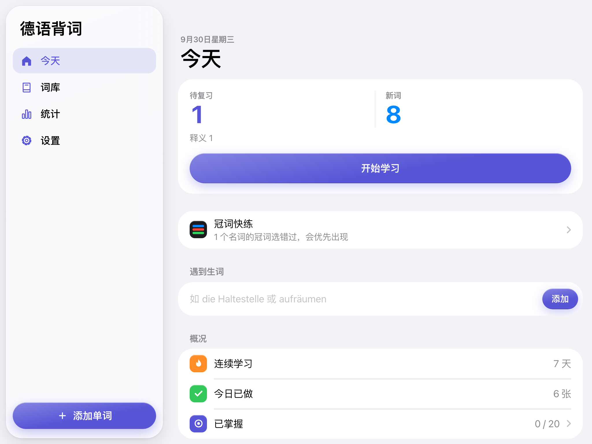
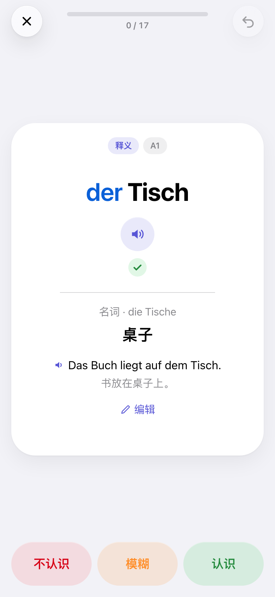
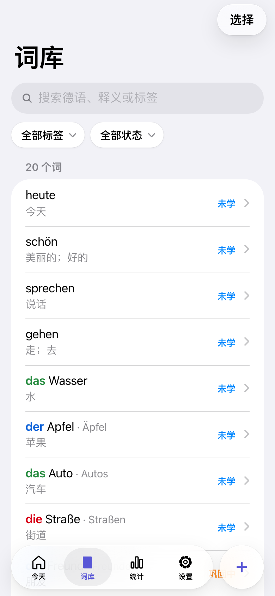
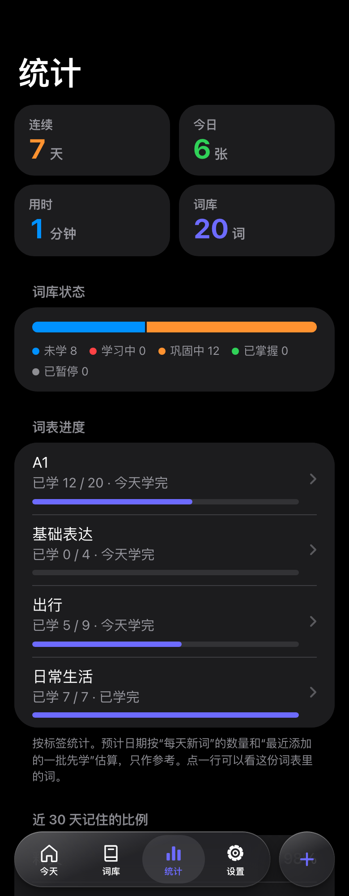

# vocab-de

[English](README.md) | 中文

在浏览器里背德语单词的应用。面向手机、平板和电脑，支持普通浏览器离线学习，安装成应用是可选项。多设备同步是可选的，数据放在你自己控制的服务器上。界面有中文和英文，释义可以用任何语言写。



| 冠词反馈与三档评分 | 搜索与管理词库 | 深色模式下的学习进度 |
|:---:|:---:|:---:|
| <a href="docs/screenshots/zh/study.png"></a> | <a href="docs/screenshots/zh/words.png"></a> | <a href="docs/screenshots/zh/stats.png"></a> |

截图使用内置示例词和模拟学习记录，在桌面浏览器中按平板、手机尺寸拍摄。点击图片可查看大图。

## 功能

- 内置 20 个 A1 示例词，可以先试用，再导入自己的词表
- 支持标签和批量选择，可批量整理标签、暂停／恢复复习及删除词条
- 除了单词，也能收句子和固定搭配（`Das ist mir egal.`、`auf jeden Fall`），拼写时忽略标点，个别打错会提示而不是直接判错
- 选中一批词或一个标签可以自由练习，不影响复习安排，适合考前过一遍
- 统计页列出经常忘的词；同一个词反复答错时会提示你去补例句或拆开记

- 一个词一张卡：看德语回想意思，按“不认识 / 模糊 / 认识”三档自评，和墨墨背单词一样。名词第一次见直接显示冠词；之后复习时先不显示，点 der / die / das 作答的同时翻出释义，不记得可以直接看答案。冠词选错或没记住，这次最多算“模糊”，因为记德语名词本来就要连冠词一起记。这个行为可以在设置里关掉
- 生词表里早就会的词，新词卡上点“早就会了”，第一次复习排到两周后，不用把每个词都学一遍；一轮结束会列出这一轮没记住的词，可以点进去补笔记或再过一遍
- 拼写练习（可选，默认关闭）：看意思写德语，名词要带冠词，词义记牢以后才会出现；拼对自动算“认识”，不想打字时点“看答案”自评。打开后每天用时大约翻倍
- 复习调度使用 [FSRS](https://github.com/open-spaced-repetition/fsrs4anki/wiki/The-Algorithm)（作者叶峻峣曾在墨墨做记忆算法，FSRS 源自墨墨的 DHP 模型），目标记忆率可选 85% / 90% / 95%。当天第一次作答决定下次什么时候复习；选“不认识”或“模糊”的词当天几分钟后会再出现，直到选“认识”，这些重复不影响长期安排
- 学习量可控：设置里只有一个“每天新词”，旁边按你自己的答题速度估算两个月后每天要花多少分钟；停学一段时间回来，积压的复习会分到几天里，期间暂停新词
- 新词先学最近添加的一批，批内按原顺序，所以课本新一课和刚遇到的生词不用排在大词表后面
- 冠词选错时会提示词尾规律（-ung → die、-chen → das 等），复合词会指出最后一部分（Haustür → die Tür），规律不适用的词会标成例外
- 冠词快练：从学过的名词里抽，冠词错得多的出现得多，不影响复习安排
- 答对、答错和完成一轮有简短音效，可在设置里关闭；手机静音时不响
- 词表进度：统计页按标签显示已学多少、已掌握多少，并按每天新词的数量估算学完的日子；添加和编辑时有查词典的快捷入口（德语助手、Wiktionary、LEO 或 dict.cc，在新标签页打开，应用本身不发送任何数据）
- 从别处添加：网页里选中一个词，点书签就能带着这个词和它所在的句子（作为例句）打开添加页；iPhone 的快捷指令、自己写的工具也能用同样的链接。格式和书签代码在 导入格式说明 里
- 粘贴或从文件导入（.txt、.csv、.tsv，可直接拖进来），包括本应用导出的 CSV、Anki 导出的纯文本和 Excel 存的 GBK 编码 CSV。能识别常见词表写法：`der Tisch, -e 桌子`、`der Tisch, -e - table`、`gehen, ging, ist gegangen = to go`、Goethe 词表、表格里复制的两列；复数标记会展开成完整形式
- 离线优先：数据存在浏览器里（IndexedDB），每个版本的文件全部预先缓存，有网时再同步
- 界面参考 iOS 设计，宽屏时换成侧边栏；支持深色模式、调节字号、减弱动态效果和降低透明度
- 用系统自带的德语语音朗读，电脑上有快捷键

## 浏览器要求

前端使用 IndexedDB、Service Worker、ES 模块和现代 CSS，面向 iOS、iPadOS、Android、macOS、Windows、Linux 上较新的浏览器。目前没有经过完整验证的最低版本兼容表；安装入口、语音和存储行为会随浏览器与设备变化。

朗读调用 Web Speech。德语语音是否可用、能否离线朗读取决于浏览器和系统，应用本身不附带音频文件。

## 运行方式

只在本机学习可用静态托管；自部署同步可用 Node.js＋SQLite；托管同步可用 Cloudflare Workers＋D1。三种方式共用前端。学习规则仍针对德语；中文和英文是界面语言，释义可以用任何语言。

### 用 Node.js 自己部署

需要 Node.js 22.13 以上。VPS、NAS 或任何常开的电脑都可以。

```bash
npm install
export SYNC_TOKEN='replace-with-a-long-random-secret'
npm start
```

| 环境变量 | 默认值 | 用途 |
|---|---|---|
| `SYNC_TOKEN` | 未设置 | 同步口令。每个口令对应一份独立词库。三个同步变量都不设置也能用，只是没有同步 |
| `SYNC_TOKENS` | 未设置 | 更多口令，逗号或空格分隔，每人一个，各自一份词库 |
| `SYNC_OPEN` | 未设置 | 设为 `1` 时，任何人带 16 位以上的口令就会自动得到属于自己的词库，适合公开的实例 |
| `PORT` | `8787` | HTTP 端口 |
| `HOST` | `0.0.0.0` | 监听地址；本机反向代理可设为 `127.0.0.1` |
| `DB_PATH` | `vocab-de.sqlite` | SQLite 数据库路径，相对路径以运行目录为准 |

Service Worker 和剪贴板等安全上下文功能需要 HTTPS，本机开发可使用 localhost。其他设备通过网络访问时，需要在前面加一个带证书的反向代理，比如 [Caddy](https://caddyserver.com)：`caddy reverse-proxy --from vocab.example.com --to localhost:8787`。

### Cloudflare Workers

使用 Workers 静态资源与 D1，不必维护 Node 服务器。所有请求都经过 Worker，由它给页面加上安全响应头（严格的内容安全策略等），请求量按 Worker 计，个人使用远低于免费额度，部署时仍请查看自己账号的当前用量限制。

```bash
npm install
npx wrangler login
npx wrangler d1 create vocab-de
```

把输出里的 `database_id` 填进 `wrangler.jsonc`，再运行：

```bash
npx wrangler secret put SYNC_TOKEN
npx wrangler deploy
```

多人使用同理：`npx wrangler secret put SYNC_TOKENS` 填入多个口令，或在 `wrangler.jsonc` 的 `vars` 里设 `SYNC_OPEN` 为 `"1"`。

数据表会在第一次请求时自动创建。

### 静态托管，不带同步

前端就是一组普通文件。运行 `node scripts/build-sw.mjs`，把 `public/` 目录上传到任何静态托管（GitHub Pages、Netlify、自己的网页服务器）。除了同步，其他功能都能用；数据留在各自设备上，可以用 设置 → 导出 / 导入备份 转移。

## 直接使用与可选安装

打开部署后的网址就能开始学习，本机学习不需要账号，也不要求安装。首次离线使用前先联网打开，等待整套资源缓存完成；普通浏览器可以从收藏夹进入。

如果浏览器提供安装功能，可按需使用以下入口：

- iPhone / iPad：Safari 点“分享” → “添加到主屏幕”
- Mac：Safari 菜单“文件” → “添加到程序坞”
- Android：Chrome 菜单 → “安装应用”
- Windows / macOS / Linux 上的 Chrome 或 Edge：地址栏的安装图标，或者应用里 设置 → 安装

不要假设浏览器标签页与安装后的应用共享本地数据。在准备使用的入口连接同步或导入 JSON 备份。安装本身不能保证数据永不被清理。

启用同步需要先部署同步后端。**一个口令对应一份词库**：自己的几台设备在 设置 → 同步 中填同一个口令；别人要用，就让他用自己的口令，词库互不相见。私人部署时，管理员把每个人的口令写进 `SYNC_TOKEN` / `SYNC_TOKENS`；开放的实例上，在设置里点“生成新口令”即可。口令就是词库的钥匙，丢了找不回，请自己保存。连接其他设备：在一台设备的设置里点“复制口令给其他设备”，到另一台设备的设置里点“粘贴”。

一台已经有词的设备换成另一个口令时，这些词会合并进新口令的词库，应用会先问一声；如果是别人用过的设备，先在设置里清空本机数据。

界面语言跟随系统，可以在 设置 → 语言 里切换。

## 导入格式

一行一个词。德语和释义之间用 tab、` - `、` = ` 或 `: ` 分隔；中文释义可以直接跟在后面。

```
der Tisch, -e 桌子
die Mutter, ¨ - mother
der Lehrer, - teacher
das Kind (-er) - child
gehen, ging, ist gegangen = to go
Zeitung
```

逗号后面单独的 `-` 表示“复数和单数相同”，不算分隔符。以句号、问号、感叹号结尾或较长的行按句子处理，两三个词的按短语处理。没写释义或冠词的，可以在导入预览里直接补。

文件导入（添加页“从文件导入”，或设置 → 词表 → 导入词表）。应用里有“导入格式说明”，也可以下载填好示例的 CSV 模板：

- 有表头的 CSV：认识 `lemma`/`德语`/`单词`、`meaning`/`释义`、`article`/`冠词`、`plural`/`复数`、`example`/`例句`、`tags`/`标签` 等列名，本应用导出的 CSV 可原样导回。复数列可以写完整形式或 `-e`、`¨-er` 这类标记，`—` 表示无复数。导入后会显示识别到了哪些列
- 没有表头的 CSV 或 TSV：依次为德语、释义、例句、例句翻译
- Anki：在 Anki 里选“纯文本格式的笔记”导出，`#` 开头的行会跳过，字段里的 HTML 会去掉
- 其他文本文件按上面的逐行格式读

## 同步方式

客户端先按服务器序号增量拉取，再上传本机改动，每个口令的序号和记录都是独立的。同一个词在两台设备上都改过时，在客户端分开合并：释义等内容以后编辑的为准，每种卡片以后复习的为准，所以一台设备上的离线复习不会覆盖另一台上的编辑。合并结果会再上传，各设备最终一致。服务器本身只按更新时间保留较新的记录。设备时钟不一致可能影响合并结果。复习记录按独立 ID 同步。Cloudflare Worker 和 Node 服务器提供的是同一套接口。

## 数据与备份

词条、复习记录和设置保存在本机。JSON 导出包含词条、复习记录和设置，导入时合并词条和复习记录，备份里的设置比本机新时一并恢复。没开同步时，首页会在两周没备份后提醒一次。CSV 只包含词表，不含复习记录，可以再导入。清除网站数据及浏览器存储回收可能影响本地数据。迁移域名或浏览器配置前先导出备份。

每个同步口令对应一份独立词库，没有账号、邮箱或密码找回。服务器只保存口令的哈希，所有记录按它分开存放；持有某个口令的人可以读取和修改这份词库，看不到别人的。口令保护 `/api/*`，应用页面本身仍可公开访问。开放实例上每份词库有大小上限（20 万条记录，单条 64 KB），但没有别的限流，公开部署请放在带限流的反向代理或 Cloudflare 规则后面。生产环境使用 HTTPS，同步不是端到端加密，服务器管理员能看到词库内容。

从只有一个共享表的旧版本升级时，原有数据会在第一次请求时自动归到 `SYNC_TOKEN` 对应的词库，旧表改名为 `records_migrated` 保留。升级后第一次启动请保持 `SYNC_TOKEN` 不变。

Node 后端启用 SQLite WAL 模式。应使用一致性 SQLite 备份，或停服后保留数据库及仍存在的 `-wal` 文件，再重启服务。运行时只复制主数据库文件可能漏掉最近写入。D1 的备份由 Cloudflare 单独管理。

## 开发

```bash
npm install
npm start          # Node 服务器，http://localhost:8787
npm run dev        # 或者 Cloudflare 本地环境（需要 .dev.vars 里写 SYNC_TOKEN）
npm test           # 单元测试
npm run test:e2e   # 浏览器冒烟测试，先运行一次 npx playwright install chromium webkit
npm run screenshots # 使用独立示例数据重新拍摄中英文 README 截图
```

```
public/              前端，纯 HTML/CSS/ES 模块，不需要打包
  js/fsrs.js         FSRS 调度
  js/german.js       词条解析、复数推导、冠词规律、拼写比对
  js/importer.js     文件导入：编码识别、CSV、Anki 文本
  js/store.js        IndexedDB 存储、选卡、统计
  js/sync.js         增量同步
  js/i18n.js         中英文案
  js/dict.js         在线词典链接
  js/sfx.js          音效（Web Audio 合成，无音频文件）
  js/app.js          界面
src/worker.js        同步接口 /api/sync，两种后端共用
src/headers.js       安全响应头，两种后端共用
src/sw.js            Service Worker 模板，构建时生成 public/sw.js
server/node.mjs      自部署服务器
server/d1-sqlite.mjs 用 SQLite 实现接口需要的 D1 方法
scripts/             构建脚本
test/                单元测试（node --test）
e2e/                 浏览器冒烟测试（Playwright）
```

## 许可证

[MIT](LICENSE)
